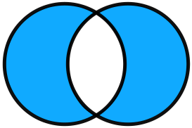

# Your basic bit [][godoc-bit]

### Set data structure for positive numbers

A bit array, or bit set, is an efficient set data structure.
It consists of an array that compactly stores bits and it uses
bit-level parallelism to perform operations quickly.

### Installation

Once you have [installed Go][golang-install], run this command
to install the `bit` package:

    go get github.com/yourbasic/bit
    
### Documentation

There is an online reference for the package at
[godoc.org/github.com/yourbasic/bit][godoc-bit].

### Roadmap

* The API of this library is frozen.
* Version numbers adhere to [semantic versioning][sv].

The only accepted reason to modify the API of this package is to
handle issues that can't be resolved in any other reasonable way.

Stefan Nilsson – [korthaj](https://github.com/korthaj)

[godoc-bit]: https://godoc.org/github.com/yourbasic/bit
[golang-install]: http://golang.org/doc/install.html
[sv]: http://semver.org/
